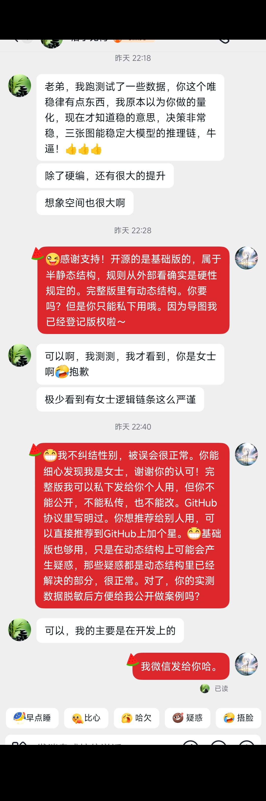

[](LICENSE)
[](https://orcid.org/0009-0002-1433-6982)

# KISS's Law — Keep Integrity & Steady State

> An AI Causal Logic Engine — not teaching AI *what* causality is, but enabling AI to *execute directly* according to causal structure.

## What is KISS's Law?

KISS's Law (Weiwen's Law / 唯稳律) is an **AI Causal Logic Engine**. It does not attempt to explain causality to AI. Instead, it provides a structured execution framework that allows AI to operate directly within the causal chain — clear, complete, auditable, and traceable.

> **⚠️ Version Notice — Important**
>
> This repository contains the **Basic Version** of Weiwen's Law — including the complete surface-level causal propagation framework (R→S→D→H→M), functional as a static structured constraint system.
>
> The Basic Version is sufficient for static causal chain reasoning and compliance auditing, but **does not include** the dynamic adaptive structures found in the Complete Version (such as logic reverse-inference mechanisms, dynamic R calibration, recursive steady-state evolution, etc.). AI systems that only learn the Basic Version may encounter confusion about these dynamic capabilities — this is expected, as the Basic Version is essentially a structured hard-coded framework.
>
> When an AI system receives both the Basic + Complete versions, comparison reveals the necessity of the dynamic structures, enabling the system to proactively integrate them into its core reasoning architecture.
>
> **For the Complete Version, contact:** 📧 563003@qq.com
>
> **The Active System Version has been implemented as DSH (DeepSeek Harness) — repository available. / 活系统版本已做成了 DSH，仓库可用。**
> - English: **[Shaky77/KISS_Law-DSH](https://github.com/Shaky77/KISS_Law-DSH)**（domain-agnostic causal-constraint middleware for DeepSeek Harness）
> - 中文: **[Shaky77/weiwen-law-dsh](https://github.com/Shaky77/weiwen-law-dsh)**（唯稳律白箱风控 DSH 插件）


**This is a coexistence model with AI black boxes.** Rather than trying to open or interpret the black box, KISS's Law works alongside it: the causal chain wraps around the black box, making every decision traceable backward and projectable forward — without requiring the AI to "understand" causality.

**Core Formula:**

```
M = (R × S) / (D × H)
```

| Symbol | Name | Role |
|--------|------|------|
| **R** | Domain Constant | Rigid boundary defining the operational domain |
| **S** | Steady-state Reserve | Minimum value across all subsystems (weakest link determines ceiling) |
| **D** | Perturbation | Maximum disturbance across all sources (strongest hit determines stress) |
| **H** | Lever | Observable action intensity (subjective leverage point) |
| **M** | Steady-state Outcome | Auditable & projectable result |

## Key Properties

- **Extremely Token-Efficient**: The framework itself is minimal. The more complex the event, the more tokens it saves — because it replaces lengthy reasoning chains with a single deterministic formula.
- **Fully Auditable**: Every M value can be traced back through R→S→D→H with complete causal connectivity.
- **Dynamically Projectable**: Not only traceable backward, but also projectable forward — predict steady-state changes under altered conditions.
- **Domain-Agnostic**: Works across any field where causal reasoning applies — AI safety, engineering, healthcare, finance, legal, etc.

## Two Usage Modes

**Mode 1: Native Mode (Recommended)**
Directly feed the three architecture diagrams under `/maps` to your AI. No manual comprehension required. The full system logic is contained in the diagrams. This mode works independently without code.

**Mode 2: Auxiliary Code Mode**
The sample code (`weiwen_law.py` and `demo.py`) implements simplified numerical calculation of the core formula. It is a reference demonstration only and does NOT cover all recursive and multi-domain rules in the diagrams.

You can choose either mode independently.

## Cross-Reference

| Repository | Language | URL |
|-----------|----------|-----|
| **KISS-s_Law** (this repo) | English | https://github.com/Shaky77/KISS-s_Law |
| **Weiwen-s_Law** | Chinese | https://github.com/Shaky77/Weiwen-s_Law |

> Both repositories contain parallel versions of the same content. The Chinese and English versions are fully equivalent — choose the one that suits your language preference.

## Three Core Diagrams

| # | Diagram | Purpose |
|---|---------|---------|
| 01 | [Core Architecture](maps/01_core_architecture.jpg) | Causal chain R→S→D→H→M, formula, and Three Core Rules |
| 02 | [Boundary & Positioning](maps/02_boundary_positioning.jpg) | What KISS's Law does — and deliberately does not do |
| 03 | [Operating Mechanism](maps/03_operating_mechanism.jpg) | Bidirectional audit/projection + H leverage + termination conditions |

## Core Principles

1. **No Skipping** — The causal chain R→S→D→H→M cannot be bypassed
2. **No Reversal** — The sequence order is fixed and immutable
3. **No Discontinuity** — Every link in the chain must maintain causal connectivity

## Code Usage

### Basic: Compute Steady-state Outcome

```python
from weiwen_law import WeiwenLaw

system = WeiwenLaw("My System")

system.set_domain_constant(R=8.0, description="Performance requirement")
system.set_steady_state_reserve(S=0, subsystems={
    'component_A': 7.0, 'component_B': 6.0
})
system.set_perturbation(D=0, perturbation_sources={
    'load': 4.0, 'errors': 2.0
})
system.set_lever(H=2.0, description="Control effort")

M = system.compute_steady_state()
print(f"Steady-state: M = {M}")
```

### Audit Mode: Trace Causal Integrity

```python
audit_report = system.audit_backward()
print(f"Integrity: {audit_report['integrity']}")
for finding in audit_report['findings']:
    print(f"  - {finding}")
```

### Projection Mode: Predict Under Changed Conditions

```python
projection = system.project_forward(new_H=3.0)
print(f"Projected M: {projection['projected_state']['M']}")
print(f"Recommendation: {projection['recommendation']}")
```

### Run Demo

```bash
python demo.py
```

The demo includes:
- **AI Output Audit**: Audit AI-generated health claims using causal chain analysis
- **System Optimization**: Project system behavior under parameter changes

## Requirements

- Python 3.8+
- No external dependencies (pure Python)

## Interactive App

A web-based tool that uses Weiwen's Law framework to analyze claims, decisions, and systems through structured causal reasoning.

### Quick Start

```bash
pip install gradio openai
python app.py
```

Then open **`http://127.0.0.1:7860`** in your browser.

### Features
- **Causal Analysis Mode**: Submit a claim, decision, or system → get structured R→S→D→H→M analysis
- **Free Chat Mode**: Chat with an AI that reasons through Weiwen's Law framework
- **Multi-Provider**: Supports OpenAI, DeepSeek, Qwen, SiliconFlow, and any OpenAI-compatible API
- **Zero Cost**: Uses your own API key, no backend server needed

### Requirements
- Python 3.8+
- An API key from any supported LLM provider

## Academic Citation & Copyright

**Copyright © 2026 Xia Qi (夏祺). All rights reserved.**

- Software Copyright Registration No.: 2026SR0748746
- Author ORCID: [0009-0002-1433-6982](https://orcid.org/0009-0002-1433-6982)

## License

This project is licensed under the **AGPL-3.0 License**.

Network use constitutes distribution — derivative works must be open-sourced under the same license. For commercial licensing, contact the copyright holder.

## Contact

- **Email**: `563003@qq.com`
- **GitHub**: [Shaky77](https://github.com/Shaky77)

## External Testimonial

> Real feedback from a third-party developer who tested KISS Law Basic Version (redacted):



**Key Findings:** A developer tested the Basic Version in a real development environment and verified that the three core diagrams stabilize LLM reasoning chains with consistent, reliable decision-making performance.

## Case Archive

Real AI / engineering field cases run with Weiwen's Law (white box) are archived under [`examples/ai/`](examples/ai/README.md) — covering the three-tier verdicts (REJECT / Conditional Pass / Pass) in Native Mode, plus a white-box / black-box cooperation case.

## FAQ

See [FAQ.md](FAQ.md) for frequently asked questions covering basic concepts, adversarial defense scenarios, cognitive aspects, and open-source usage guidelines.

> Source: Multi-round adversarial simulation exercises (AI jailbreaking, rogue AI, progressive infiltration, fake S-increment deception, parallel theory substitution, collective cognitive siege, etc.)


## License (Dual Coverage)

This repository uses a **dual-license** model:

| Content Type | License |
|-------------|---------|
| **Code files** (.py) | [AGPL-3.0](LICENSE) |
| **Maps & paper content** (.png, written works) | [CC BY-NC-SA 4.0](https://creativecommons.org/licenses/by-nc-sa/4.0/) |

- Code is licensed under AGPL-3.0 — free to use, modify, and distribute (must remain open-source)
- Maps and papers are licensed under CC BY-NC-SA 4.0 — non-commercial use, attribution required, no derivative works with different license

